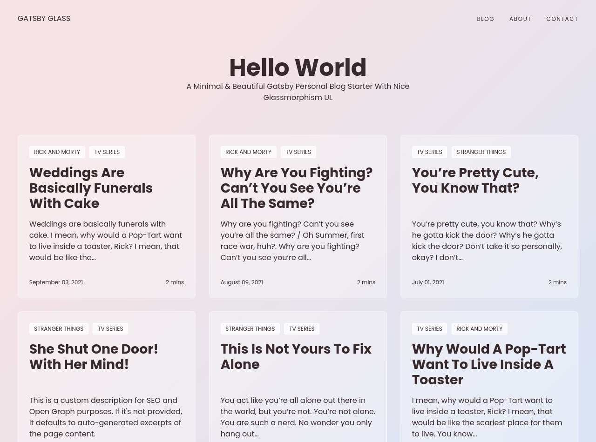

## purpose and goal

After my first real-world GatsbyJS project, I wanted to contribute to the Gatsby community.

I decided to create a GatsbyJS personal blog starter with glassmorphism UI design (a design trend I've been eyeing). I called it gatsby-starter-glass.

## general requirement

As always, apart from the bare minimum that the generated website must be fast and responsive.

I had a few requirements in mind to be able to call this project a success:

The user interface should be minimal and beautiful. and use the Glassmorphism design trend.

It should also be easy for others to customize and build upon the project.

Non-technical users should be able to add and update the site content.

## stack explanation

I wanted to use a CMS that I haven't used before, I used Netlify CMS.

CSS in js is my go-to for styling in React apps. Great things have been said about it already, and my preferred tool for that is Styled-components, mainly because it lets you write actual CSS and it's popular.

## challenges

The Netlify CMS documentation isn't the greatest and there's not a lot of resources to learn from, I ran into a few hiccups integrating NetlifyCMS with Gatsby, I overcame these by checking a lot of other open-source using Netlify CMS and Gatsby, learned from them and adjusted to my use case.

# wrapping up

I improved my Gatsby Skill and I learned another headless CMS.
I finally had a chance to hop on the Glassmorphism UI design trend.
